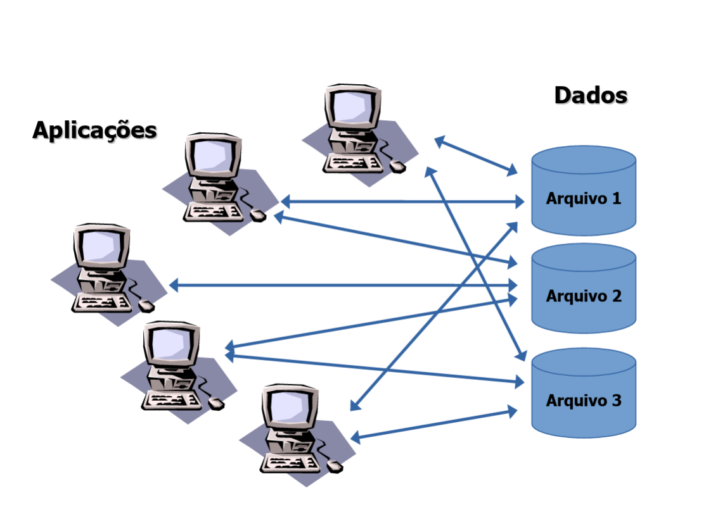
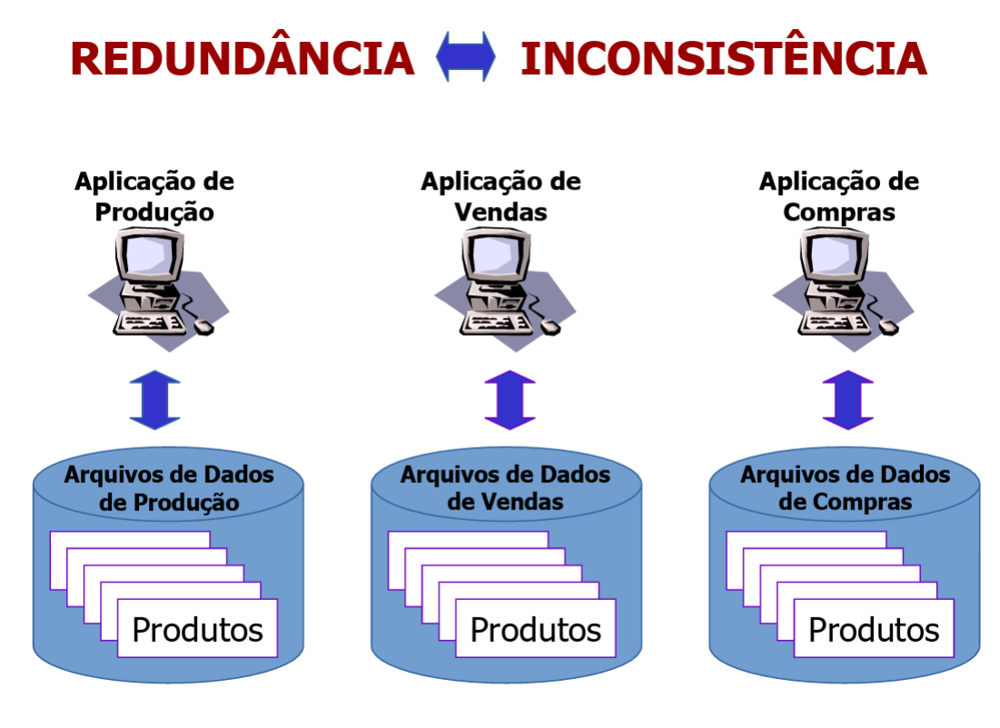

# Introdução a sistemas de bancos de dados

## Sistemas de informação

Para a alta evolução dos sistemas de bancos de dados tivemos antes um avanço dos próprios sistemas de informação, a partir desse ponto temos sistemas de informação baseados em gerenciamento de arquivos, onde:

- Cada unidade da organização possui seus programas e arquivos;
- Temos programas curtos para tarefas específicas;
- Dados armazenados em disco;
- Cada arquivo usa uma estrutura de dados.

Figura 1 - Esquemograma sistemas de informações

Fonte - Slides do professor Maurício

 

Figura 2 - Redundância e inconsistência nos sistemas de informações

Fonte - Slides do professor Maurício

## Consistência de dados

- **Consistência** é o "estado ou caráter do que é coerente, do que tem solidez, veracidade, credibilidade, estabilidade, **realidade**";
- Se determinada que a informação é replicada (redundância), seu valor deve ser sempre o mesmo.

## Sistemas da informação (SIs) baseados em arquivos

Como tudo no mundo da tecnologia podemos ver claramente alguns problemas nesses tipos de sistemas, alguns deles são:

- Redundância e inconsistência de de dados;
- Dificuldade de acesso aos dados;
- Isolamento de dados;
- Anomalias no acesso concorrente;
- Segurança.

Nesses tipos de sistemas de informação temos os dados gravados em disco usando **estrutura de dados**, ou seja, o acesso demanda conhecimento dessas estruturas de dados, chamamos isso de dependência de dados.

## Dependência de dados