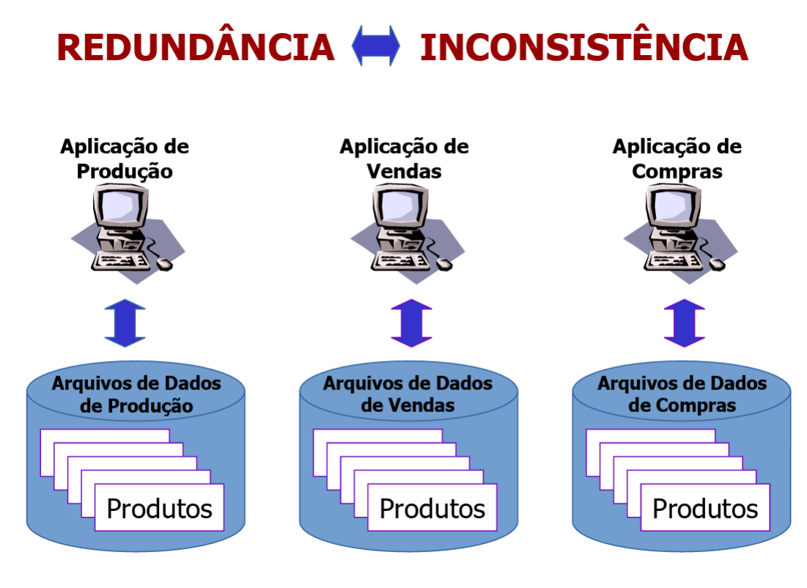
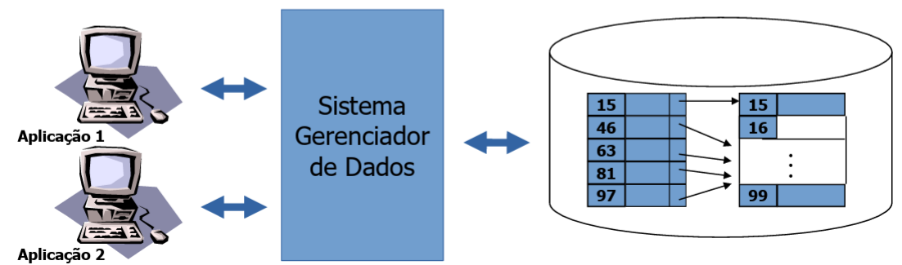
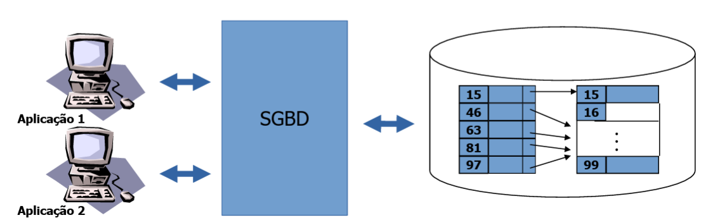
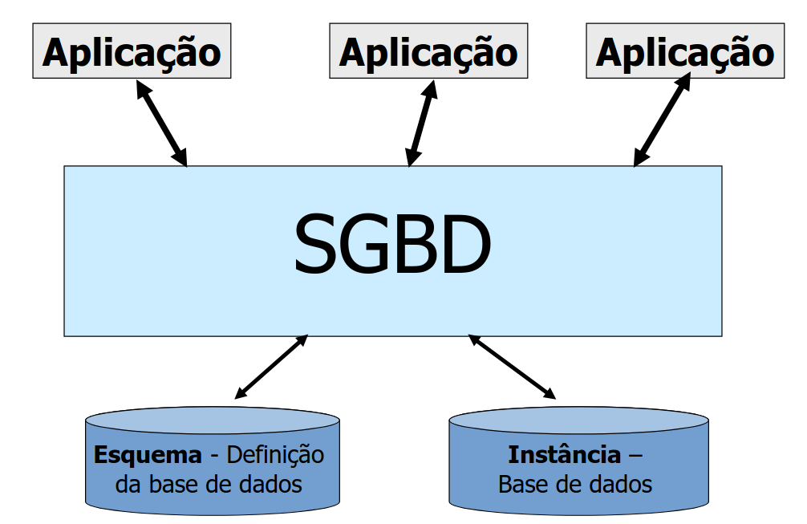
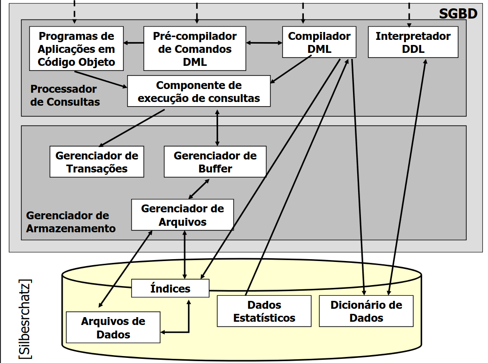

# Introdução a sistemas de bancos de dados

## Sistemas de informação

Para a alta evolução dos sistemas de bancos de dados tivemos antes um avanço dos próprios sistemas de informação, a partir desse ponto temos sistemas de informação baseados em gerenciamento de arquivos, onde:

- Cada unidade da organização possui seus programas e arquivos;
- Temos programas curtos para tarefas específicas;
- Dados armazenados em disco;
- Cada arquivo usa uma estrutura de dados.

Figura 1 - Esquemograma sistemas de informações

Fonte - Slides do professor Maurício

 

Figura 2 - Redundância e inconsistência nos sistemas de informações

Fonte - Slides do professor Maurício

## Consistência de dados

- **Consistência** é o "estado ou caráter do que é coerente, do que tem solidez, veracidade, credibilidade, estabilidade, **realidade**";
- Se determinada que a informação é replicada (redundância), seu valor deve ser sempre o mesmo.

## Sistemas da informação (SIs) baseados em arquivos

Como tudo no mundo da tecnologia podemos ver claramente alguns problemas nesses tipos de sistemas, alguns deles são:

- Redundância e inconsistência de de dados;
- Dificuldade de acesso aos dados;
- Isolamento de dados;
- Anomalias no acesso concorrente;
- Segurança.

Nesses tipos de sistemas de informação temos os dados gravados em disco usando **estrutura de dados**, ou seja, o acesso demanda conhecimento dessas estruturas de dados, chamamos isso de dependência de dados.

## Dependência de dados

- Vários programas compartilhando os mesmos dados;
- Todos devem estudar e conhecer as mesmas estruturas;
- **Acoplamento forte**;
- Se houver uma alteração na estrutura de dados **todos os programas devem ser alterados**.

Mas como podemos fazer com que não tenhamos essa dependência de dados? A resposta é simples, criando um sistema que gerencie a estrutura. Veja com com as imagens abaixo, uma ilustração simplificada do funcionamento.

Figura 3 - Funcionamento do sistema gerenciador de dados

Fonte - Slides do professor Maurício

 

Figura 4 - SGBD (Sistema gerenciador de banco de dados)

Fonte - Slides do professor Maurício

## Sistema gerenciador de banco de dados (SGBD)

- Composto por:
    - Conjunto de dados
        - Base de dados;
        - Tabelas e índices;
        - Tuplas.
    - Conjunto de programas
        - Acesso dos dados;
        - Manipulação dos dados.
- É um sistema de propósito geral
    - Mantém um conjunto lógico e organizado de dados;
    - Armazena grande volume de dados;
    - Permite busca e atualização dos dados;
    - É eficiente;
    - É autônomo em relação às aplicações

Figura 5 - SGBD aplicado

Fonte - Slides do professor Maurício

- Requisitos fundamentais
  - Segurança
    - Física (mais comum no passado)
    - Lógica
        - Usernames e passwords;
        - Perfis de usuário.
    - Integridade
        - Consistência;
        - Validade. 
    - Recuperação e tolerância a falhas
        - Transações atômicas
        - Registros de log
        - Backup
    - Controle da concorrência
  
Temos dentro do mundo de bancos de dados restrições de integridade. Essas restrições definem o que é válido e o que não é válido para nós dentro desse contexto, alguns exemplos de restrições de integridade são:

- Um funcionário não pode pertencer a mais de um departamento;
- O preço de venda de um produto não pode ser superior ao seu custo;
- O código de cada produto deve ser único.

Figura 6 - Componetes de um SGBD

Fonte - Slides do professor Maurício

## Utilizando um SGBD

1. Modelagem
    - Modelo entidade/relacionamento;
    - Modelo relacional.
2. Definição
    - SQL DDL
3. Instnciação
    - SQL DDL/DML
4. Uso
    - SQL DML

A interface dos bancos de dados é definida pela linguagem declarativa DQL(DDL+DML). Agora vamos ver masi doic conceitos procedural e declarativo:

- **Procedural**: Exige especificações de quais dados são necessário e como conseguimos obtê-los.
    - Requer uma sequência específica de operações a serem executadas;
- Não-procedural (declarativo): Exige apenas especificação de quais dados são necessários, e não de como obtê-los.

SQL - Data Definition Language (DDL) tem um conjunto de comandos para a definição do esquema de base de dados, temos como seus principais elementos:

- **create**
- **alter**
- **drop**

Assim como já se pode imaginar, se podemos criar e estamos falando de banco de dados moderno, obviamente podemos manipular esses dados também, os principais elementos de manipulação de dados são

- **select**
- **insert**
- **delete**
- **update**

Mais um conccieto importante é o de **metadados** que também podemos chamar de **dicionário de dados**. São os bancos de dados do sistema, nele se armazena a descrição do sistema, metadados e restrições de segurança e integridade. Temos ainda outras denominações para esses metadados, são eles catálogo de dados, e diretório de dados.

Figura 7 e 8 - Fluxo SGBD

Fonte - Slides do professor Maurício

