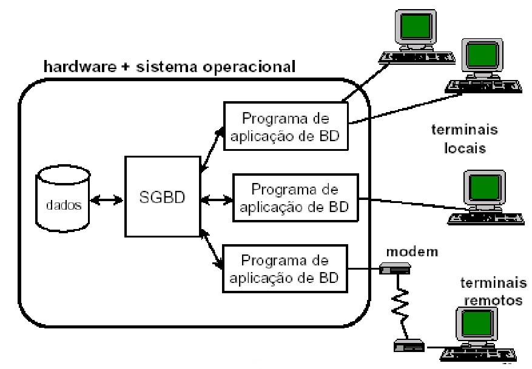
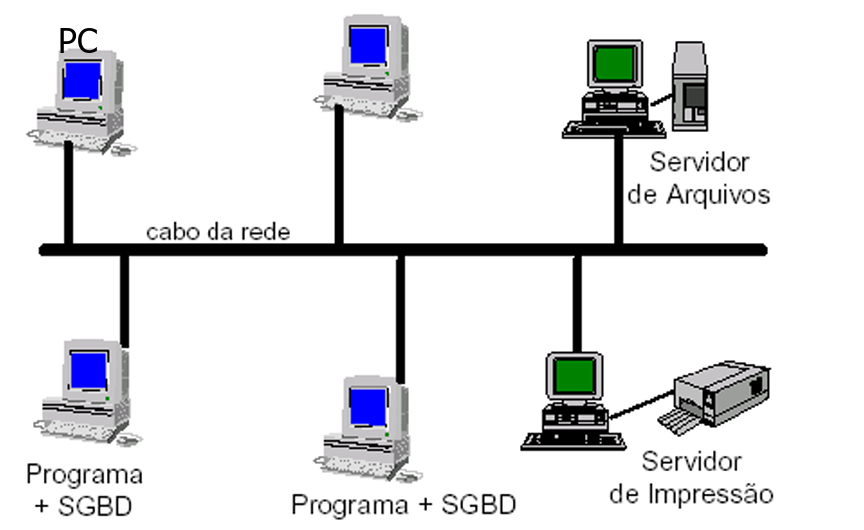
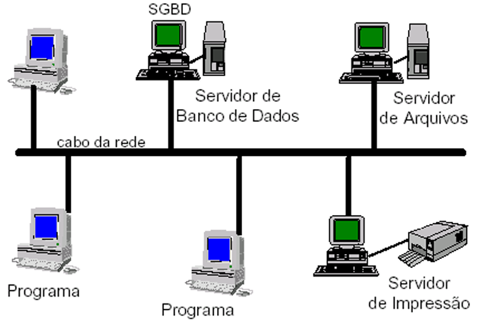

# Evolução dos sistemas de banco de dados : Arquiteturas cliente/servidor

- **Bancos de dados centralizados (Década de 70):** Neste modelo, temos um único servidor central (um mainframe) que executa absolutamente tudo: ele armazena os dados, gerencia o banco de dados e roda os próprios programas de aplicação. Funciona da seguinte forma: Os usuários utilizam terminais "burros" (apenas tela e teclado) para se conectar. Cada comando digitado é enviado ao servidor, que processa a informação e devolve uma tela inteira como resposta. Nenhum processamento ocorre no terminal. O principal problema desse método é o alto custo e o fato de que o servidor é um ponto único de falha. Além disso, o desempenho cai drasticamente conforme mais usuários se conectam, pois todos competem pelos recursos de uma única máquina central.

Figura 9 - Banco de dados centralizado

Fonte - Slides do professor Maurício

- **Arquitetura Cliente/Servidor com servidor de arquivos:** Neste modelo, temos um servidor "passivo" que apenas centraliza e armazena arquivos, sem processar ou entender seu conteúdo. Funciona da seguinte forma: O cliente pede o arquivo inteiro ao servidor. O servidor simplesmente localiza e envia uma cópia completa desse arquivo pela rede. Todo o processamento e as alterações são feitos na máquina do cliente, que ao final envia o arquivo inteiro de volta para ser salvo. O principal problema desse método é o tráfego de rede intenso e o fato de que apenas um usuário pode editar o arquivo por vez. O servidor precisa "travá-lo" para os demais, deixando-o em modo de leitura para evitar que as alterações de um sobrescrevam as de outro.

Figura 10 - Arquitetura cliente servidor com servidor de arquivos

Fonte - Slides do professor Maurício

**Arquitetura Cliente/Servidor com servidor de bancos de dados:** Neste modelo, temos um servidor "inteligente" que centraliza e gerencia os dados através de um Sistema de Banco de Dados (como MySQL, PostgreSQL, etc.). Funciona da seguinte forma: O cliente não pede o arquivo inteiro. Em vez disso, ele envia uma pergunta específica (uma query) ao servidor, como por exemplo: "Liste todos os produtos com preço abaixo de R$50". O servidor recebe essa pergunta, processa internamente os dados e envia de volta para o cliente apenas a resposta, e não o banco de dados todo. A principal vantagem desse método é que o processamento pesado ocorre no servidor. Vários clientes podem alterar dados ao mesmo tempo de forma segura, pois o servidor gerencia os acessos de forma granular e inteligente, garantindo a consistência das informações sem precisar "travar" o acesso para outros usuários.

Figura 11 - Arquitetura cliente servidor com servidor de bancos de dados

Fonte - Slides do professor Maurício
