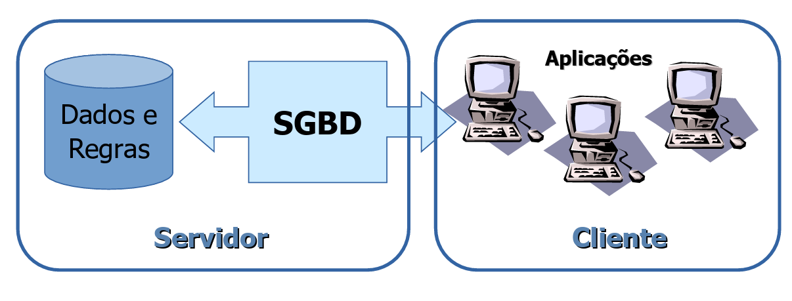

# Evolução dos sistemas de banco de dados : Arquiteturas cliente/servidor

- **Bancos de dados centralizados (Década de 70):** Neste modelo, temos um único servidor central (um mainframe) que executa absolutamente tudo: ele armazena os dados, gerencia o banco de dados e roda os próprios programas de aplicação. Funciona da seguinte forma: Os usuários utilizam terminais "burros" (apenas tela e teclado) para se conectar. Cada comando digitado é enviado ao servidor, que processa a informação e devolve uma tela inteira como resposta. Nenhum processamento ocorre no terminal. O principal problema desse método é o alto custo e o fato de que o servidor é um ponto único de falha. Além disso, o desempenho cai drasticamente conforme mais usuários se conectam, pois todos competem pelos recursos de uma única máquina central.

Figura 9 - Banco de dados centralizado

Fonte - Slides do professor Maurício

- **Arquitetura Cliente/Servidor com servidor de arquivos:** Neste modelo, temos um servidor "passivo" que apenas centraliza e armazena arquivos, sem processar ou entender seu conteúdo. Funciona da seguinte forma: O cliente pede o arquivo inteiro ao servidor. O servidor simplesmente localiza e envia uma cópia completa desse arquivo pela rede. Todo o processamento e as alterações são feitos na máquina do cliente, que ao final envia o arquivo inteiro de volta para ser salvo. O principal problema desse método é o tráfego de rede intenso e o fato de que apenas um usuário pode editar o arquivo por vez. O servidor precisa "travá-lo" para os demais, deixando-o em modo de leitura para evitar que as alterações de um sobrescrevam as de outro.

Figura 10 - Arquitetura cliente servidor com servidor de arquivos

Fonte - Slides do professor Maurício

**Arquitetura Cliente/Servidor com servidor de bancos de dados:** Neste modelo, temos um servidor "inteligente" que centraliza e gerencia os dados através de um Sistema de Banco de Dados (como MySQL, PostgreSQL, etc.). Funciona da seguinte forma: O cliente não pede o arquivo inteiro. Em vez disso, ele envia uma pergunta específica (uma query) ao servidor, como por exemplo: "Liste todos os produtos com preço abaixo de R$50". O servidor recebe essa pergunta, processa internamente os dados e envia de volta para o cliente apenas a resposta, e não o banco de dados todo. A principal vantagem desse método é que o processamento pesado ocorre no servidor. Vários clientes podem alterar dados ao mesmo tempo de forma segura, pois o servidor gerencia os acessos de forma granular e inteligente, garantindo a consistência das informações sem precisar "travar" o acesso para outros usuários.

Figura 11 - Arquitetura cliente servidor com servidor de bancos de dados

Fonte - Slides do professor Maurício

## Arquitetura Cliente/Servidor

Arquitetura Cliente-Servidor: A Espinha Dorsal dos Bancos de Dados Modernos
A arquitetura cliente-servidor é um modelo de computação que distribui tarefas e cargas de trabalho entre dois tipos principais de componentes: os clientes, que solicitam serviços ou dados, e os servidores, que fornecem esses recursos. Essa estrutura é a base para a grande maioria das aplicações de rede que usamos hoje, e é especialmente fundamental para o funcionamento dos sistemas de gerenciamento de bancos de dados (SGBDs).

Ao relacionar essa arquitetura com bancos de dados, podemos entender como interagimos com informações de forma segura, centralizada e eficiente, seja ao usar um aplicativo de banco, um sistema de gestão empresarial ou até mesmo uma rede social.

Os papéis de cada um no banco de dados **O cliente (Frontend):** O cliente é a parte do sistema com a qual o usuário interage diretamente. Reposnável por apresentação, solicitação, exibição dos resultados; Já o **O servidor (Backend):** O servidor é o componente robusto que fica nos bastidores. No contexto de bancos de dados, o servidor é o SGBD em si (como Oracle, MySQL, PostgreSQL, SQL Server). Suas principais funções são armazenamneto e gerenciamento de dados, processamento de requisições, controle de acesso e segurança, garantia de integridade e consistência , backup e recuperação.

Figura 12 - Arquitetura cliente servidor

Fonte - Slides do professor Maurício

- **Duas camadas:** A arquitetura de duas camadas é o modelo cliente-servidor mais fundamental e direto. Pense nela como uma linha de comunicação direta entre a aplicação do usuário e o banco de dados, sem intermediários. Nesse modelo, o sistema é dividido em apenas duas partes lógicas, ou "camadas"
    - **Camada de Apresentação (Cliente):** Esta é a aplicação que roda diretamente na máquina do usuário (por exemplo, um programa instalado em um computador de escritório). A grande característica deste modelo é que a camada cliente acumula duas responsabilidades principais 
        - Lógica de Apresentação: É responsável por toda a interface com a qual o usuário interage: as telas, os formulários, os botões e os menus. 
        - Lógica de Negócio (Regras da Aplicação): Contém toda a "inteligência" do sistema. Validações (ex: "o campo de e-mail é válido?"), cálculos e as regras que ditam o funcionamento do negócio estão embutidas diretamente no código desta aplicação cliente.
    - **Camada Servidor (O Banco de Dados):** A segunda camada é o próprio Sistema de Gerenciamento de Banco de Dados (SGBD), como PostgreSQL, MySQL, SQL Server, etc. Sua função neste modelo é mais passiva e focada:
        - Armazenamento e Gerenciamento: Sua principal responsabilidade é guardar os dados de forma segura e organizada.
        - Execução de Comandos: Ele apenas aguarda as solicitações (queries SQL) que chegam dos clientes, executa esses comandos e devolve o resultado.
        - Controle de Acesso e Integridade: Garante que apenas usuários autorizados possam se conectar e que as regras básicas dos dados (constraints) sejam respeitadas.

Figura 13 - Arquitetura cliente servidor: Duas camadas

Fonte - Slides do professor Maurício

- **Três camadas:** Este é o modelo mais comum para aplicações web e sistemas corporativos. Ele introduz uma camada intermediária 
    - **Camada de Apresentação (Cliente):** O navegador ou aplicativo móvel do usuário. É responsável apenas pela interface. 
    - **Camada de Aplicação (Servidor de Aplicação):** Um servidor intermediário que contém a lógica de negócio do sistema. Ele recebe as requisições genéricas do cliente, as processa e, então, se torna o "cliente" do servidor de banco de dados, enviando as queries SQL. 
    - **Camada de Dados (Servidor de Banco de Dados):** O SGBD, que apenas armazena, gerencia e retorna os dados solicitados pela camada de aplicação.

Figura 13 - Arquitetura cliente servidor: Três camadas

Fonte - Slides do professor Maurício

- **Quatro camadas:** Na arquitetura de 4 camadas é como se fosse um especialização de de 3 camadas pnde temos 
    - **Camada de Apresentação (Cliente):** Exatamente a mesma da camada de apresentação da de 3 camadas. 
    - **Camada de Lógica de Apresentação ou "Web" (Web Tier / Presentation Logic Tier):** Lidar com requisições HTTP, gerenciar sessões de usuário, formatar os dados que vêm da camada de negócio para serem exibidos na interface e processar as entradas do usuário para enviá-las à camada de negócio. Essencialmente, ela controla o fluxo da aplicação web. 
    - **Camada de Lógica de Negócio (Business Logic Tier):**  Implementar as regras de negócio centrais e complexas da aplicação. É aqui que ocorrem os cálculos, as validações de dados e as orquestrações de processos que são independentes da forma como são apresentados. Por exemplo, em um e-commerce, o cálculo de frete, a validação de um cupom de desconto ou o processo de aprovação de um pedido residem aqui. 
    - **Camada de Dados (Servidor de Banco de Dados):** Exatamente como o anterior.

Figura 14 - Arquitetura cliente servidor: Quatro camadas

Fonte - Slides do professor Maurício
