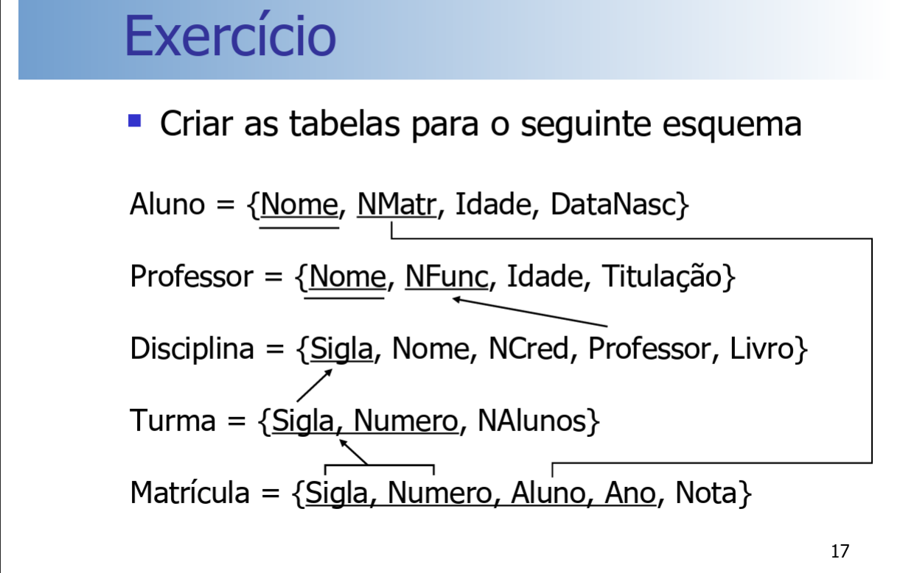

## Introdução

<p>O SQL é uma lingaugem declarativa não procedural desenvolvida e implementada pelo laboratório de pesquisa da IBM em San Jose nos anos 70, inicialmente chamada de SEQUEL (Structured English QUEry Language), criada como interface entre usuários e o primeiro SGBDR - SYSTEM R. Hoje é um padrão industrial que atinge grande parte do mercado de SGBDs, suas principais qualidades e atrativos são: Pequena qunatidade de comandos para realizar uma grande quantidade de operações, simplicidade, grande poder de consultas, e o seu padrão facilita migração.</p>

## Alguns tipos de dado no SQL:

- INTEGER | SMALLINT | NUMBER
- DECIMAL [precision, scale]
    - precision: Número total de dígitos
    - scale: Número de dígitos depois do ponto
- DOUBLE PRECISION | FLOAT | REAL
- CHAR(n)
    - Tamanho fixo 
    - n = Quantidade de caracteres
- VARCHAR(n)
    - Tamanho variável
    - n = Número máximo de caracteres
- BLOB
    - Binary Large Object
- DATE | TIME | TIMESTAP

<p>Na linguagem SQL temos dois principais comandos, sçao eles:</p>

- **DDL - Data Definition Language:** Especificação do esquema da base de dados.
- **DML - Data Manipulation Language:** Inserção, remoção, alteração e consultas na instância da base de dados.

## DDL e DML

- **DDL: CREATE, DROP e ALTER**
    - TABLE, DATABASE, DOMAIN, EXCEPTION, GENERATOR, INDEX, PROCEDURE, ROLE, SHADOW, TRIGGER e VIEW.
- **DML: SELECT (FROM), DELETE (FROM), INSERT (INTO), UPDATE**

<p>Existem variações entre os fabricantes sobre o conjunto de funcionalidades e como essas funcionalidades operam</p>

## Comandos DDL: 

- **CREATE TABLE -** Criar uma tabela, deefinir colunas e restrições

```SQL
CREATE TABLE tabela(
    atrib1 tipo [<restrições da coluna 1>],
    atrib2 tipo [<restrições da coluna 2>],
    ....
    atribn tio [<restrições da coluna n>],
    
    <restrições da tabela>
);
```

- Restrições de colunas
    - NOT NULL
    - DEFAULT valor
    - CHECK(condição)

```SQL
CREATE TABLE tabela(
    atrib1 tipo [(tamanho)] [NOT NULL | DEFAULT valor] [CHECK (condição)],
    atrib2 tipo [(tamanho)] [NOT NULL | DEFAULT valor] [CHECK (condição)],
    ...
);
```

- Restrições de tabela
    - PRIMARY KEY (>atributos de chave primária<)
    - UNIQUE (>atributos de chave candidata<)
    - FOREIGN KEY (>atributos de chave estrangeira<)
    - REFERENCES tabelaRef [(>chave primária<)]
- >ações<
    - ON DELETE | ON UPDATE
        - CASCADE | SET NULL | SET DEFAULT

<p align="center">Exemplo de criação de tabela</p>

```SQL
CREATE TABLE tabela(
    atrib1 tipo [(tamanho)] [NOT NULL | DEFAULT valor] [CHECK (condição)],
    atrib2 tipo [(tamanho)] [NOT NULL | DEFAULT valor] [CHECK (condição)],
    ...
    [CONSTRAINT nome da restrição]
        PRIMARY KEY (<atributos de chave primária>),
    [CONSTRAINT nome da restrição]
        UNIQUE (<atributos de chave candidata>)
    [CONSTRAIN nome da restrição]
        FOREIGN KEY (<atributos da chave estrangeira>)
                    REFERENCES tabelaRef [(<chave primária>)]
            [ON DELETE CASCADE | SET NULL | SET DEFAULT]
        [ON UPDATE CASCADE | SET NULL | SET DEFAULT],
        [CONSTRAINT nome da restrição]
            CHECK (condição)
);
```

### Exercício 1

<div style="text-align: center;">
    
    <p>Fonte - Slides Maurício</p>
</div>

```SQL
CREATE TABLE Aluno (
    Nome VARCHAR(50),
    NMatr CHAR(9) PRIMARY KEY,
    Idade INT,
    DataNasc DATE
);

CREATE TABLE Professor(
    Nome VARCHAR(50), 
    NFunc CHAR(10) PRIMARY KEY, 
    Idade INT,
    Titulacao VARCHAR(50)
);

CREATE TABLE Diciplina(
    Sigla VARCHAR(7) PRIMARY KEY,
    Nome VARCHAR(50),
    NCred INT, 
    Professor VARCHAR(10) REFERENCES Professor(NFunc),
    Livro VARCHAR(50)
);

CREATE TABLE Turma(
    Sigla VARCHAR(7) REFERENCES Diciplina(Sigla),
    Numero INT,
    NAlunos INT,
    PRIMARY KEY(Sigla, Numero)
);

CREATE TABLE Matricula(
    Sigla VARCHAR(7) REFERENCES Diciplina(Sigla),
    Numero INT REFERENCES Turma(Numero),
    Alunos VARCHAR(9) REFERENCES Aluno(NMat)
    Ano INT
    Nota DECIMAL(3, 2), 
    PRIMARY KEY(Sigla, Numero, Aluno)
);
```

## Comandos DDL