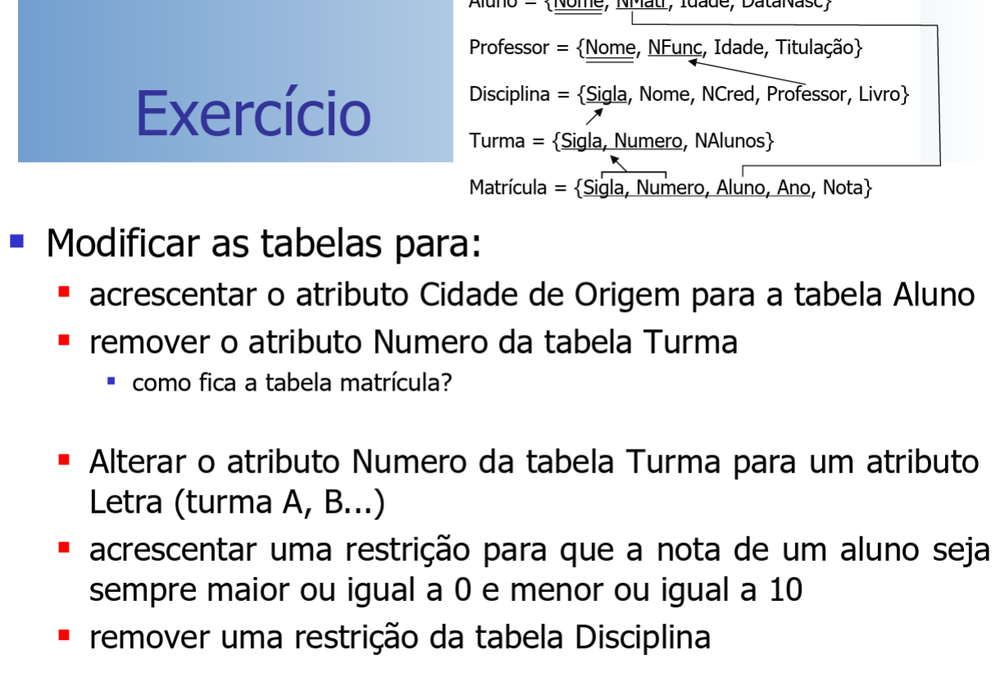
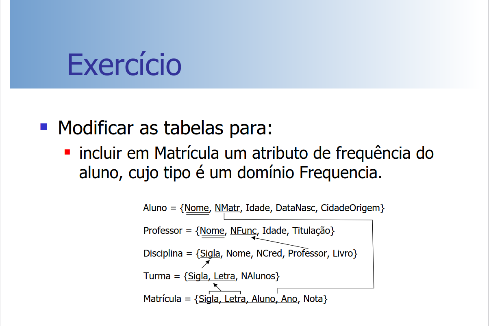

## Introdução

<p>O SQL é uma lingaugem declarativa não procedural desenvolvida e implementada pelo laboratório de pesquisa da IBM em San Jose nos anos 70, inicialmente chamada de SEQUEL (Structured English QUEry Language), criada como interface entre usuários e o primeiro SGBDR - SYSTEM R. Hoje é um padrão industrial que atinge grande parte do mercado de SGBDs, suas principais qualidades e atrativos são: Pequena qunatidade de comandos para realizar uma grande quantidade de operações, simplicidade, grande poder de consultas, e o seu padrão facilita migração.</p>

## Alguns tipos de dado no SQL:

- INTEGER | SMALLINT | NUMBER
- DECIMAL [precision, scale]
    - precision: Número total de dígitos
    - scale: Número de dígitos depois do ponto
- DOUBLE PRECISION | FLOAT | REAL
- CHAR(n)
    - Tamanho fixo 
    - n = Quantidade de caracteres
- VARCHAR(n)
    - Tamanho variável
    - n = Número máximo de caracteres
- BLOB
    - Binary Large Object
- DATE | TIME | TIMESTAP

<p>Na linguagem SQL temos dois principais comandos, sçao eles:</p>

- **DDL - Data Definition Language:** Especificação do esquema da base de dados.
- **DML - Data Manipulation Language:** Inserção, remoção, alteração e consultas na instância da base de dados.

## DDL e DML

- **DDL: CREATE, DROP e ALTER**
    - TABLE, DATABASE, DOMAIN, EXCEPTION, GENERATOR, INDEX, PROCEDURE, ROLE, SHADOW, TRIGGER e VIEW.
- **DML: SELECT (FROM), DELETE (FROM), INSERT (INTO), UPDATE**

<p>Existem variações entre os fabricantes sobre o conjunto de funcionalidades e como essas funcionalidades operam</p>

## Comandos DDL: 

- **CREATE TABLE -** Criar uma tabela, deefinir colunas e restrições

```SQL
CREATE TABLE tabela(
    atrib1 tipo [<restrições da coluna 1>],
    atrib2 tipo [<restrições da coluna 2>],
    ....
    atribn tio [<restrições da coluna n>],
    
    <restrições da tabela>
);
```

- Restrições de colunas
    - NOT NULL
    - DEFAULT valor
    - CHECK(condição)

```SQL
CREATE TABLE tabela(
    atrib1 tipo [(tamanho)] [NOT NULL | DEFAULT valor] [CHECK (condição)],
    atrib2 tipo [(tamanho)] [NOT NULL | DEFAULT valor] [CHECK (condição)],
    ...
);
```

- Restrições de tabela
    - PRIMARY KEY (>atributos de chave primária<)
    - UNIQUE (>atributos de chave candidata<)
    - FOREIGN KEY (>atributos de chave estrangeira<)
    - REFERENCES tabelaRef [(>chave primária<)]
- >ações<
    - ON DELETE | ON UPDATE
        - CASCADE | SET NULL | SET DEFAULT

<p align="center">Exemplo de criação de tabela</p>

```SQL
CREATE TABLE tabela(
    atrib1 tipo [(tamanho)] [NOT NULL | DEFAULT valor] [CHECK (condição)],
    atrib2 tipo [(tamanho)] [NOT NULL | DEFAULT valor] [CHECK (condição)],
    ...
    [CONSTRAINT nome da restrição]
        PRIMARY KEY (<atributos de chave primária>),
    [CONSTRAINT nome da restrição]
        UNIQUE (<atributos de chave candidata>)
    [CONSTRAIN nome da restrição]
        FOREIGN KEY (<atributos da chave estrangeira>)
                    REFERENCES tabelaRef [(<chave primária>)]
            [ON DELETE CASCADE | SET NULL | SET DEFAULT]
        [ON UPDATE CASCADE | SET NULL | SET DEFAULT],
        [CONSTRAINT nome da restrição]
            CHECK (condição)
);
```

- **ALTER TABLE** - Incluir/Alterar/Remover definições de colunas e restrições
    - ALTER TABLE tabela >ação<
        - >ação<:
            - ADD novoAtrib tipo [>restrições de coluna<]
            - ADD [CONSTRAINT nome] >Restrições da tabela<
            - DROP atributo [CASCADE | RESTRICT]
            - DROP CONSTRAINT nome
            - ALTER atributo SET DEFAULT >valor<
            - ALTER atributo DROP DEFAULT   
    - ADD novoAtrib tipo [>restrições de coluna<]
    - DROP atributo [CASCADE | RESTRICT]
        - CASCADE - Todas as visões e restrições (constraints) que referenciam o atributo são removidos automaticamente
        - RESTRICT - Atributo só é removido se não houver nenhuma visão ou restrição que o referencie
    - CREATE DOMAIN nome AS tipo
        - Cria um nome de domínio para especificar um tipo de dado
        - Dacilita alterações de tipos de dados
        - Simplifica a legibilidade

 <p align="center">Exemplos CREATE DOMAIN</p>

 ```SQL
 CREATE DOMAIN CUSTNO 
 AS INTEGER
 DEFAULT 9999
 CHECK (VALUE > 1000)

-- OUTRO EXEMPLO

CREATE DOMANIN PRODTYPE
AS VARCHAR(12)
CHECK(VALUE IN ('software','hardware', 'other', 'NA'));
 ```

### Exercício 1

<div style="text-align: center;">
    
    <p>Fonte - Slides Maurício</p>
</div>

```SQL
CREATE TABLE public.Aluno (
    Nome VARCHAR(50),
    NMatr CHAR(9) PRIMARY KEY,
    Idade INT,
    DataNasc DATE
);

CREATE TABLE public.Professor(
    Nome VARCHAR(50), 
    NFunc CHAR(10) PRIMARY KEY, 
    Idade INT,
    Titulacao VARCHAR(50)
);

CREATE TABLE public.Diciplina(
    Sigla VARCHAR(7) PRIMARY KEY,
    Nome VARCHAR(50),
    NCred INT, 
    Professor VARCHAR(10) REFERENCES Professor(NFunc),
    Livro VARCHAR(50)
);

CREATE TABLE public.Turma(
    Sigla VARCHAR(7) REFERENCES Diciplina(Sigla),
    Numero INT,
    NAlunos INT,
    PRIMARY KEY(Sigla, Numero)
);

CREATE TABLE public.Matricula(
    Sigla VARCHAR(7) REFERENCES Diciplina(Sigla),
    Numero INT,
    Alunos VARCHAR(9) REFERENCES Aluno(NMatr),
    Ano INT,
    Nota DECIMAL(3, 2), 
    PRIMARY KEY(Sigla, Numero, Alunos),
    FOREIGN KEY (Sigla, Numero) REFERENCES Turma(Sigla, Numero)
);
```
### Exercício 2

<div style="text-align: center;">
    
    <p>Fonte - Slides Maurício</p>
</div>

<p align="center">Modificando o código anterior de criação de tabela</p>

```SQL
ALTER TABLE aluno ADD cidade_origem VARCHAR(50);

ALTER TABLE turma DROP COLUMN numero;
-- Não deixa só se for CASCADE
ALTER TABLE turma DROP COLUMN numero CASCADE;


```
 
- O que acontece com a tabela matrícula?
    - Sem usar o CASCADE:
        - Ele não deixa apagar se não for utilizado o CASCADE, pois a chave estrangeira de matrícula depende do numero da turma.
        - Perda de Dados: Se a coluna numero for removida e ela contém dados que são necessários para a tabela matricula, você poderá perder a integridade referencial, ou seja, não será mais possível relacionar registros de matricula com turma.
        - Erros em Consultas: Qualquer consulta ou operação que dependa da coluna numero em matricula pode falhar após a remoção da coluna. Isso inclui joins, consultas e operações que utilizam essa coluna.
    - Utilizando o CASCADE:
        - A chave estrangeira FOREIGN KEY (Sigla, Numero) REFERENCES Turma(Sigla, Numero), agora é FOREIGN KEY (Sigla) REFERENCES Turma(Sigla).

### Exercício 3

<div style="text-align: center;">
    
    <p>Fonte - Slides Maurício</p>
</div>

```SQL
CREATE DOMAIN Frequencia 
AS INTEGER 
DEFAULT 100 
CHECK (VALUE >= 0 AND VALUE <=100);
```